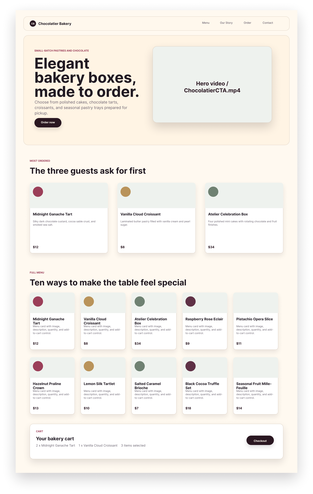
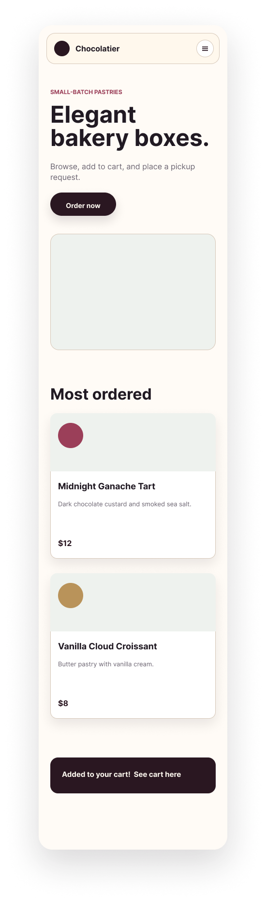

<div align="center">

# Chocolatier Bakery Restaurant — Reproduction d'une maquette Figma

**HTML5 · Tailwind CSS v4** — Projet réalisé dans le cadre de la formation **CDA (Simplon)**, 2026.

Reproduction pixel-close, **mobile first**, d'une maquette Figma « Chocolatier Bakery Restaurant Template » à l'aide de **Tailwind CSS v4** (CDN, sans étape de build), avec une palette de couleurs et une typographie extraites du style guide fourni.


</div>

---

## 📑 Table des matières

Toute la documentation détaillée du projet est découpée en pages, dans [`assets/prototype-restaurant-chocolatier/`](assets/prototype-restaurant-chocolatier), avec navigation précédent/suivant en bas de chaque page.

| # | Page | Contenu |
| --- | --- | --- |
| 01 | [Présentation du projet](assets/prototype-restaurant-chocolatier/01-presentation.md) | Contexte, objectif, sections du site à reproduire |
| 02 | [Aperçu de la maquette Figma](assets/prototype-restaurant-chocolatier/02-maquette-figma.md) | Captures desktop/mobile, méthode de vérification |
| 03 | [Structure du projet](assets/prototype-restaurant-chocolatier/03-structure-projet.md) | Arborescence complète, rôle de chaque fichier |
| 04 | [Design system / tokens Tailwind](assets/prototype-restaurant-chocolatier/04-design-system.md) | Palette de couleurs, typographies, `@theme` |
| 05 | [Sections de la page](assets/prototype-restaurant-chocolatier/05-sections-de-la-page.md) | Header, Hero, Most ordered, Full menu, Cart — détail par section |
| 06 | [Technologies utilisées](assets/prototype-restaurant-chocolatier/06-technologies.md) | Tailwind CSS v4 (CDN), Google Fonts |
| 07 | [Lancer le projet en local](assets/prototype-restaurant-chocolatier/07-lancer-en-local.md) | Clone, ouverture, serveur local |
| 08 | [Approche responsive / mobile first](assets/prototype-restaurant-chocolatier/08-responsive-mobile-first.md) | Méthode mobile first, exemple concret |
| 09 | [Vocabulaire Tailwind CSS](assets/prototype-restaurant-chocolatier/09-vocabulaire-tailwind.md) | Glossaire des classes utilitaires (layout, spacing, couleurs, responsive...) |
| 10 | [Interactivité JavaScript](assets/prototype-restaurant-chocolatier/10-interactivite-javascript.md) | Menu burger mobile fonctionnel, image hero aléatoire avec ombre et transition |
| 11 | [Images produits sur les cards](assets/prototype-restaurant-chocolatier/11-images-produits-cards.md) | Remplacement des pastilles de couleur par de vraies photos (Most ordered, Full menu) |

---

## 🖼️ Maquette (desktop & mobile)

Exports de la maquette Figma utilisés comme référence visuelle pour la reproduction pixel-close, disponibles dans [`assets/maquette/`](assets/maquette).

<div align="center">
  
  
  <br>
  <sub><b>Desktop</b> · <b>Mobile</b></sub>
</div>

---

## 🗂️ Structure du projet

```text
chocolatier-bakery-restaurant/
├── assets/
│   ├── img/
│   │   ├── svg/
│   │   │   └── logo-chocolatier.svg
│   │   ├── hero/                          # Photos locales pour l'image du Hero (aléatoire)
│   │   │   ├── photo-1.webp
│   │   │   ├── photo-2.webp
│   │   │   └── photo-3.webp
│   │   ├── order/                         # Photos des 3 cards "Most ordered"
│   │   │   ├── photo-1.webp
│   │   │   ├── photo-2.webp
│   │   │   └── photo-3.webp
│   │   └── specialite/                    # Photos des 10 cards "Full menu"
│   │       ├── image-1.webp
│   │       ├── ...
│   │       └── image-10.webp
│   ├── maquette/                          # Exports de la maquette Figma (référence visuelle)
│   │   ├── 01-desktop.png
│   │   └── 02-mobile.png
│   └── prototype-restaurant-chocolatier/  # Documentation paginée du projet
│       ├── 01-presentation.md
│       ├── 02-maquette-figma.md
│       ├── 03-structure-projet.md
│       ├── 04-design-system.md
│       ├── 05-sections-de-la-page.md
│       ├── 06-technologies.md
│       ├── 07-lancer-en-local.md
│       ├── 08-responsive-mobile-first.md
│       ├── 09-vocabulaire-tailwind.md
│       ├── 10-interactivite-javascript.md
│       └── 11-images-produits-cards.md
├── index.html                             # Page unique (Header, Hero, Most ordered, Full menu, Cart)
├── script.js                              # Menu burger mobile + image hero aléatoire
└── README.md
```

---

<p align="center">
  <a href="assets/prototype-restaurant-chocolatier/01-presentation.md"></a>
</p>
